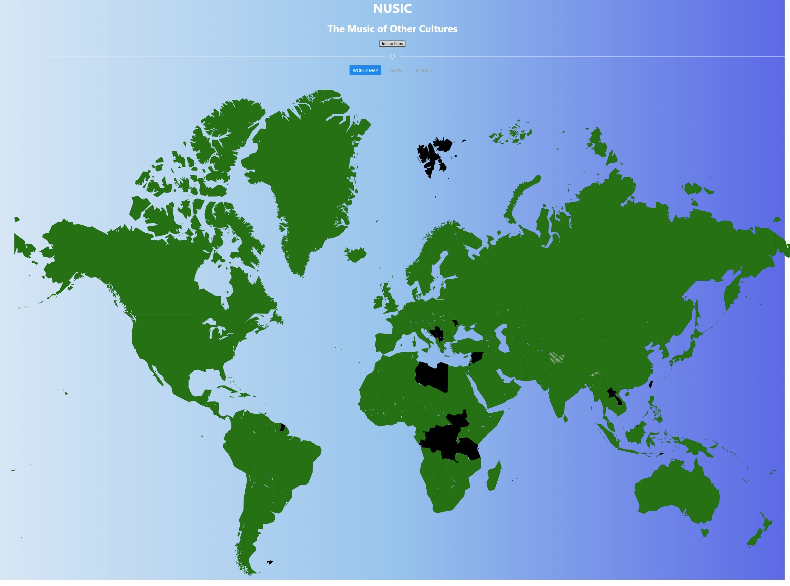

# NUSIC

NUSIC - A Website For Discovering New Music From Around The World    

---------

User Story:

As a person interested in learning about music from other countries

I want to click on any location in a rendered world map and find a list of songs

AND/OR 

I want to search for songs by a specific artist

So that I am shown the top music charts for any specified country or artist

---------

Description:

For our first group project, we decided to create a website that allows users to identify popular music in any country across the globe, simply by the click of a mouse. Thus, an interactive map takes up most of the screen so that users can effectively select any one of the 195 countries across the globe. The map also displays each country's name when scrolled over by the mouse. However, if users prefer an alternative search option, they may type in a specific artist in a search bar, which links to list of music for that artist. Specific direction on how to navigate the website can be found by clicking the 'instructions' tab which in turn opens a modal. 

---------

Instructions: 

How to search?

Move mouse icon to a specfic country 
Right-click the country to see results i.e. top 25 songs

OR

Click on the artist tab

Type in a specific artist 

Press the search button to see results i.e. top # of songs

---------

Challenges: 

1. Displaying the necessary information for each country
2. Loading interactive map to fit the page and making the map responsive
3. Ensuring that the switcher tabs functions correctly / uderstanding the uikit framework

---------

Future Plans: 

- Adding albums covers for the songs
- Embedding a media player within the site
- Adding information for the unfinished countries
- Adding a lyrics section so user can search by lyrics
- Improving the search engine so that seperate tabs are created for each search

----------
Technologies Used: 

- HTML
- CSS
- JavaScript

Image and Link:

https://mtkfolger.github.io/NUSIC/
----------

Credits:

Harrison Armstrong - https://github.com/nightmarefails
Michael Folger - https://github.com/mtkfolger
Robert Sanders Jr. - https://github.com/rsanders2
